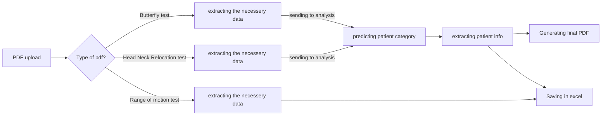

# GazePro Measurement :health_worker:

V kliničnih okoljih sta čas in natančnost ključnega pomena. Kliniki se 
pogosto soočajo z ogromnimi količinami podatkov v PDF dokumentih, kot so
pacientovi zapisi in diagnostična poročila. 
Izvlečenje in analiza pomembnih informacij iz teh PDF-jev je zamudno opravilo,
ki odvrača pozornost od oskrbe pacientov in odločanja. Tradicionalne 
ročne metode so nagnjene k napakam in neučinkovitostim, kar lahko vodi do
zamud pri diagnozi in zdravljenju.


## Vizija

> #### GazePro je inovativna aplikacija, ki avtomatizira izvlečenje podatkov iz PDF dokumentov in s pomočjo umetne inteligence določa kategorije pacientov, kar povečuje natančnost kliničnih ocen.


## Opis projekta

GazePro je aplikacija, zasnovana za poenostavitev dela klinikov z avtomatizacijo
izvlečenja in analize podatkov iz PDF dokumentov. S pomočjo naprednih algoritmov
strojnega učenja GazePro določa, v katero kategorijo spada pacient, kar povečuje
natančnost kliničnih ocen in odločitvenih procesov.

Kliniki naložijo PDF dokument, iz katerega se izvlečejo potrebni podatki, ti 
podatki pa se pošljejo modelu. Na koncu klinik prejme enoten PDF z grafom 
podatkov pacienta in napovedjo AI modela glede pacientove kategorije.

GazePro je prelomno orodje za klinike, ki ponuja robustno rešitev za izzive 
ročnega izvlečenja podatkov iz PDF-jev. Z avtomatizacijo tega procesa GazePro
ne le prihrani dragocen čas, ampak tudi izboljša natančnost in kakovost 
kliničnega odločanja. Na koncu projekt stremi k izboljšanju učinkovitosti 
in učinkovitosti kliničnih delovnih procesov, kar vodi do boljše oskrbe in
rezultatov pacientov.

## Vrednost za Uporabnike
#### Za Klinike:

* **Časovna Učinkovitost:** GazePro znatno zmanjša čas, porabljen za ročno izvlečenje podatkov iz PDF-jev. Kliniki se lahko bolj osredotočijo na oskrbo pacientov in manj na administrativne naloge.
* **Natančnost:** Avtomatizirano določanje kategorij pacientov zagotavlja visoko natančnost, kar zmanjšuje tveganje za človeške napake pri interpretaciji medicinskih podatkov.
* **Nemotena Integracija:** Aplikacija se gladko integrira z obstoječimi delovnimi procesi, kar omogoča enostavno nalaganje PDF-jev in prejemanje strukturiranih podatkovnih izhodov.
* **Izboljšano Odločanje:** Hiter dostop do organiziranih in analiziranih informacij podpira bolj informirane in pravočasne klinične odločitve.
* **Varnost Pacientov:** Z zagotavljanjem natančnih in pravočasnih informacij GazePro prispeva k boljšim rezultatom in varnosti pacientov.

## Ključne lasnost
* **Uporabniški Vmesnik:** Ponuja preprost in intuitiven vmesnik za enostavno 
obdelavo dokumentov in pridobivanje podatkov.
* **Avtomatizirano Izvlečenje Podatkov:** Uporablja napredne algoritme za 
prepoznavanje in izvlečenje tabel, imen pacientov in drugih ključnih
informacij iz PDF-jev.
* **AI-Podprto Določanje Kategorij:** Integrira specializirane modele strojnega 
učenja za določanje kategorij pacientov, kar pomaga pri klinični oceni in
odločanju.
* **Generiranje končno pdf sporočilo:**  klinik prejme enoten PDF z podatke o pacienta,
grafom podatkov (meritve) pacienta in napovedjo AI modela glede pacientove kategorije.

# Tehnični opis in način uporabe

### Electron-React desktop aplikacija za obdelavo pdf datotek
 
Ta projekt je aplikacija Electron, ki uporablja React
front-end za prikaz in Python za obdelava PDF datotek.
Aplikacija uporabnikom omogoča nalaganje datotek PDF, 
ekstrahiranje podatkov iz njih s pomočjo skripta Python 
in prikaz ekstrahiranih podatkov v obliki tabele. 
Uporabniki lahko urejajo in brišejo vrstice iz prikazanih 
podatkovnih tabel.

### Značilnosti:
* Nalaganje datoteke PDF za obdelavo
* Ekstrahiranje podatke iz datotek PDF s skriptom Python
* Prikaz ekstrahiranih podatkov v obliki tabele
* Urejanje in brisanje vrstic podatkov
* Varna komunikacija med glavnim procesom Electron (Electron main process) in React renderer process

## Tehnološki sklad
Aplikacija GazePro temelji na kombinaciji naprednih tehnologij, ki omogočajo avtomatizacijo 
procesov in povečujejo natančnost kliničnih ocen.

#### Elektron
* Electron se uporablja za razvoj namizne aplikacije, saj omogoča ustvarjanje zmogljivih, 
platformno neodvisnih aplikacij z uporabo JavaScript, HTML in CSS. Electron omogoča 
preprost dostop do sistemskih virov in integracijo z drugimi tehnologijami, kar je 
ključnega pomena za aplikacijo.
#### Node.js
* Node.js omogoča povezovanje med sprednjim in zadnjim delom aplikacije. 
Omogoča upravljanje komunikacije s Python skriptami preko IPC (inter-process communication).
#### React
* Za gradnjo uporabniškega vmesnika je uporabljen React, priljubljena knjižnica JavaScript, 
ki omogoča hitro in učinkovito razvoj interaktivnih in odzivnih uporabniških vmesnikov. 
React omogoča modularen pristop k razvoju, kar olajša vzdrževanje in nadgradnje aplikacije.
#### Tailwind CSS
* Uporablja se za hitro in učinkovito stilizacijo uporabniškega vmesnika z uporabo
utilitarnih razredov (utility classes), kar omogoča konsistentno in prilagodljivo oblikovanje.
#### Flowbite
* Zagotavlja vnaprej pripravljene komponente, združljive s Tailwind CSS, kar pospeši razvoj 
uporabniškega vmesnika in zagotavlja profesionalen videz aplikacije.
#### Python in knjižnice
* Python je uporabljen za obdelavo podatkov in napovedne modele umetne inteligence. 
Python je znan po svoji enostavnosti, berljivosti in bogatem ekosistemu knjižnic,
kar omogoča hitro in učinkovito razvoj kompleksnih algoritmov. Nekatere ključne
knjižnice vključujejo:
  * **pdfplumber** - Knjižnica za ekstrakcijo podatkov iz PDF dokumentov. Omogoča natančno
  in zanesljivo pridobivanje tabel, besedil in drugih informacij.     
  * **Orange.data** - Omogoča delo s podatki v formatu, ki je primeren za
  modele strojnega učenja v Orange ekosistemu, kar omogoča enostavno 
  integracijo z Orange modeli.
  * **pickle** - Omogoča serijalizacijo in deserializacijo modelov strojnega 
  učenja, kar omogoča shranjevanje in nalaganje modelov na disk.
  * **reportlab** - knjižnica za ustvarjanje PDF dokumentov
  * **io.BytesIO** - omogoča obravnavo binarnih podatkov v pomnilniku kot datoteko 
  za začasno shranjevanje slike grafa pred vdelavo v PDF (brez da bi jih shranjevali)
  * ...


S kombinacijo teh naprednih tehnologij aplikacija GazePro zagotavlja robustno in učinkovito
rešitev za avtomatizacijo kliničnih procesov, kar omogoča klinikom, da se osredotočijo na
svoje osnovno delo – zagotavljanje kakovostne zdravstvene oskrbe.


### Kaj smo se naučili in kje so bile težave

Med projektom smo se naučili združiti različne tehnologije za razvoj celovite aplikacije,
ki vključuje Electron za namizno aplikacijo, Tailwind CSS za oblikovanje, Flowbite za vnaprej pripravljene
komponente in IPC komunikacijo
za interakcijo med različnimi deli aplikacije. Electron je omogočil razvoj večplatformske 
aplikacije z uporabo znanja spletnih tehnologij. Tailwind CSS je bil ključnega pomena za hitro in učinkovito oblikovanje uporabniškega
vmesnika, ki je hkrati vizualno privlačen in funkcionalen. IPC komunikacija nam je omogočila
izmenjavo podatkov med različnimi deli aplikacije, kar je bilo bistveno za integracijo 
različnih funkcionalnosti in zagotavljanje gladkega delovanja aplikacije. S pomočjo Python
knjižnic smo ustvarili radar grafe in PDF poročila za vizualno predstavitev rezultatov
testov ter ustvarjali Excel datoteke za shranjevanje rezultatov.

Trenutno se soočamo s težavami pri gradnji aplikacije, kot so integracija različnih 
knjižnic in zagotavljanje pravilnega delovanja brez konfliktov.


### Okvirna predstava uporabe aplikacije



> [!IMPORTANT]
> ### Predpogoji za uporabo
> * Node.js inštaliran (v21.5.0 - različica na kateri je projekt narejen)
> * Python inštaliran (v3.11.4) in ustrezne knjižnice (sys, pdfplumer, pandas, json, numpy, ...)
> * npm (node package manager)

> [!NOTE]
> ### Kako začeti
> * npm install - potrebno naredit posebno za Electron in posebno za React da bi inštaliral potrebne package-e
>   ```bash
>    npm install
>    ```
> * V terminal zaženi React app (folder gazeProReact) - npm run dev
>   ```bash
>   npm run dev
>  ```
> * Zaženi tudi electron app (en folder nazaj od gazeProReact) - npm start
>   ```bash
>   npm start
>  ```

## Avtorji :technologist:
1. **Boban Boshevski**
2. **Andrej Bokonjić**
3. **Stefan Vujičić**

